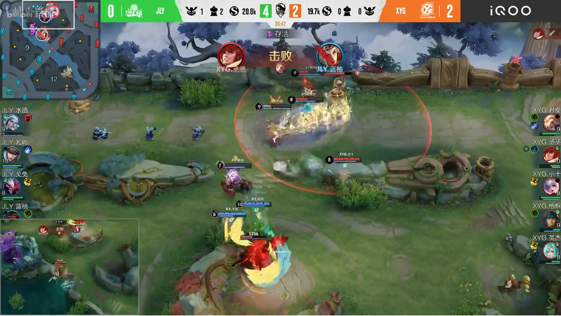
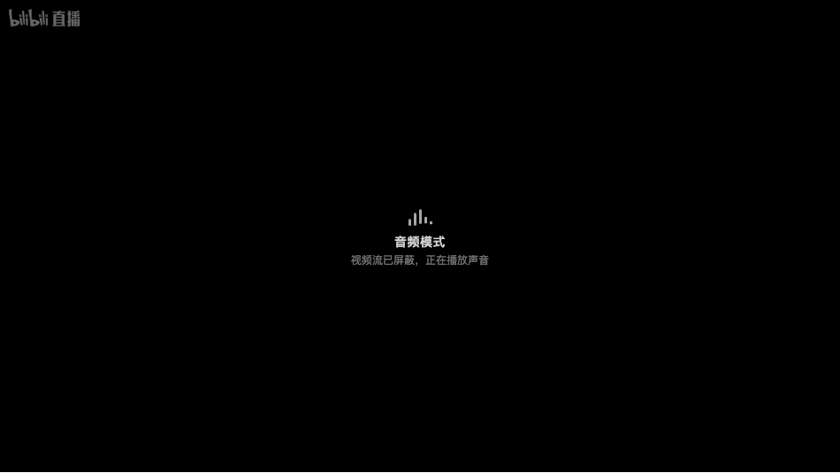

#  [Bilibili-Live-Audio-Only](https://github.com/AHCorn/Bilibili-Live-Audio-Only)

#### **简体中文** | [English](README_EN.md)

屏蔽哔哩哔哩直播画面、只播放声音以节省流量的油猴脚本。

 

## 预览

 

| 音频模式 关 | 音频模式 开 |
|:---:|:---:|
|  |  |

*示例：某官方赛事直播间*

 

## 特性

1. 音频模式开启时，脚本从取流接口层面仅请求纯音频流（只含 AAC 音轨），视频数据不会进入浏览器，而非播放后再隐藏画面。

2. 音频流仍由 B 站原生播放器播放，弹幕、礼物、人气统计、快捷键等功能不受影响。

3. 页面左下角提供悬浮开关，切换后自动刷新页面生效。音频模式默认关闭，开关状态只在当前标签页内延续；需要跨会话记忆时，在设置面板开启"保留上次开关状态"。

4. 篡改猴脚本菜单提供"音频设置"面板，含音频模式、保留上次开关状态、注入悬浮按钮三项设置。不希望页面被注入元素时，关闭"注入悬浮按钮"即可，此后仅通过菜单控制。

5. 音频模式下播放器内显示"音频模式"提示，用于区分正常工作与播放故障。

6. 开关关闭时脚本不拦截任何请求，页面行为与未安装脚本时一致。

 

## 使用说明

如果您正在使用的是 **Chrome 浏览器**，请先在 Chrome 应用商店安装 [篡改猴](https://chromewebstore.google.com/detail/%E7%AF%A1%E6%94%B9%E7%8C%B4/dhdgffkkebhmkfjojejmpbldmpobfkfo)。
如果是 **Firefox 浏览器**，请在 [这里](https://addons.mozilla.org/zh-CN/firefox/addon/tampermonkey/) 安装插件。

第一次安装完成后，请先打开一次插件，其中会有英文提示，大意为：
**请开启浏览器的开发者模式**（一般位于浏览器菜单项的插件/扩展程序部分，在顶部可以找到开发模式按钮，点击打开）。

随后在篡改猴插件中新建脚本，粘贴 `bilibili-live-audio-only.user.js` 的全部内容并保存；也可以直接打开仓库中该文件的 Raw 链接，篡改猴会弹出安装页面，此方式安装后能随仓库自动更新。

打开任意直播间，页面左下角会出现"音频模式 关"按钮。点击切换至"音频模式 开"，页面自动刷新，视频区域显示"音频模式"提示，声音正常播放，浏览器仅消耗音频流量；再次点击恢复视频播放。音频模式默认关闭，开关状态只在当前标签页内延续。

点击篡改猴插件图标，脚本菜单中的"音频设置"会打开设置面板，功能与悬浮按钮一致，并额外提供"保留上次开关状态"（跨会话记忆音频模式）与"注入悬浮按钮"开关。

 

## 实测流量

以下数据于 2026-07-11 以匿名访客身份、超清（qn=250）档位实测。流级口径直接下载两种流各 30 秒对比字节数；页面级口径用真实浏览器分别在开、关脚本状态下运行 60 秒，统计全部网络流量。

| 测试场景 | 普通模式 | 音频模式 | 节省 |
|---------|---------|---------|------|
| 流级 30s，720p 高动态画面 | 1947 kbps | 116 kbps | 94.0% |
| 流级 30s，官方赛事重播 | 1392 kbps | 202 kbps | 85.5% |
| 页面级 60s，720p 高动态画面 | 14.84 MB | 0.85 MB | 94.3% |
| 页面级 60s，赛程待机静态画面 | 1.82 MB | 1.44 MB | 20.7% |

直播视频为动态码率，节省比例随画面运动幅度与清晰度档位变化。第四行为极端场景：待机画面接近静止，视频码率本身很低，节省的绝对流量因此较小。正常直播内容（游戏、演出、比赛）的节省比例稳定在 80% 以上；清晰度档位越高比例越大，实测某原画直播间源码率约 8 Mbps，对应节省超过 97%。

 

## 工作原理

B 站直播取流接口 `getRoomPlayInfo` 存在一个网页端未使用的参数 `only_audio=1`，携带该参数时 FLV 线路返回真正的纯音频流。脚本在页面加载最早期完成三步：

1. 剥离服务端内嵌在页面中的首屏取流数据，迫使播放器重新请求取流接口；

2. 拦截 `XMLHttpRequest` 与 `fetch`，为取流请求追加 `only_audio=1`；

3. 将接口返回的候选流过滤为仅 FLV 线路。`only_audio` 仅对 FLV 生效，HLS 分片仍含视频轨，过滤可避免播放器选中 HLS 导致节省失效。

 

## 常见问题

### 1. 视频区域一直黑屏？

音频模式下黑屏是预期行为，视频数据没有被下载，画面中央会显示"音频模式"提示。需要画面时点击左下角按钮关闭音频模式即可；若已关闭悬浮按钮，从篡改猴菜单打开"音频设置"面板切换。

如果关闭后仍无画面，请先刷新页面；无效则在篡改猴中停用本脚本再刷新一次。停用后画面恢复，说明问题与本脚本相关，请复制控制台报错反馈；停用后依旧黑屏，则问题出在直播间或其它插件。

 

### 2. 为什么有时节省的流量不多？

直播视频为动态码率，画面接近静止时（赛程待机页、挂机聊天）视频码率本身较低，节省的绝对流量相应变小。画面正常运动时节省比例稳定在 80% 以上，见上方实测表。

 

### 3. 某些直播间不生效？

BW 会场、拜年祭等活动特殊页使用独立播放器，不经过标准取流接口，脚本无法生效。使用普通播放器的标准直播间均可用。

 

### 4. 会影响弹幕、礼物或其它脚本吗？

不会。脚本只修改取流请求的一个参数并过滤返回的线路列表，弹幕连接、礼物特效、快捷键均不经过这条链路。可与"哔哩哔哩自动画质"共存，但音频模式开启期间没有视频，画质切换不产生效果。

 

### 5. 这个功能会不会失效？

`only_audio` 是 B 站未公开的接口参数，存在被移除的可能。届时脚本自动退化为普通播放（有视频、不省流量），不影响直播间打开；关闭开关即可完全恢复原生行为。

 

### 6. 对脚本有一些改进的建议？

欢迎反馈。在符合"省流量听直播"这一定位且足够实用的前提下，后续更新会采纳您的建议。

 

## ♡ 感谢

取流接口的 `only_audio` 参数来自 [bilibili-API-collect](https://github.com/SocialSisterYi/bilibili-API-collect) 社区文档。
